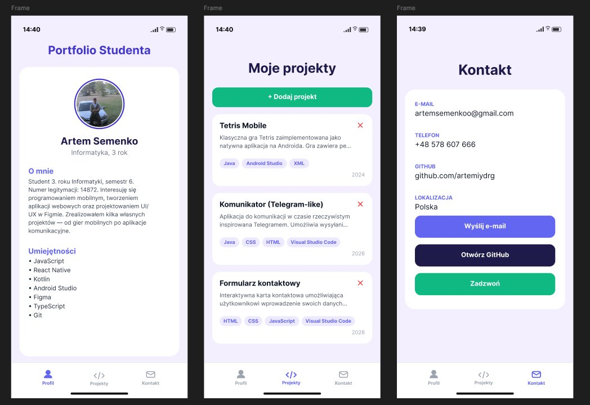
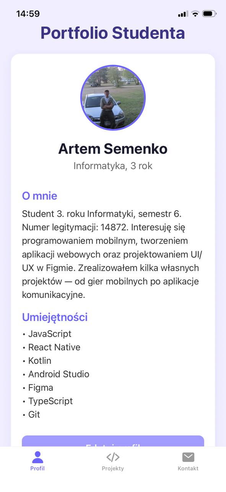
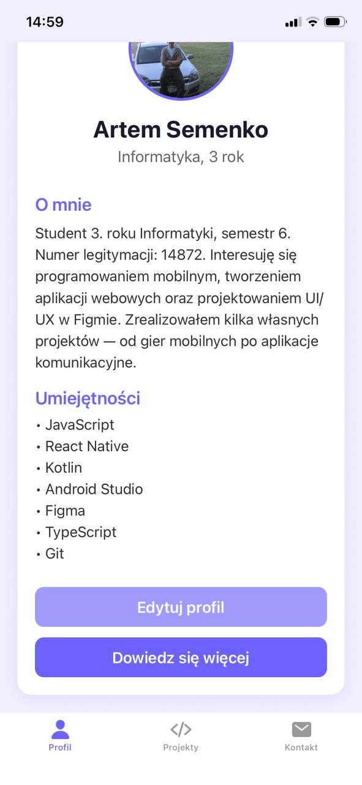
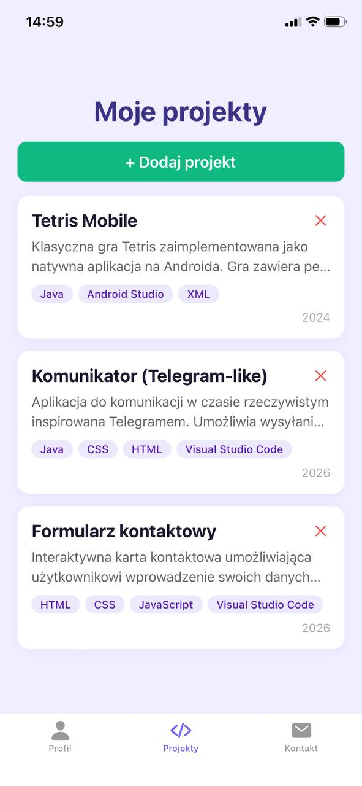
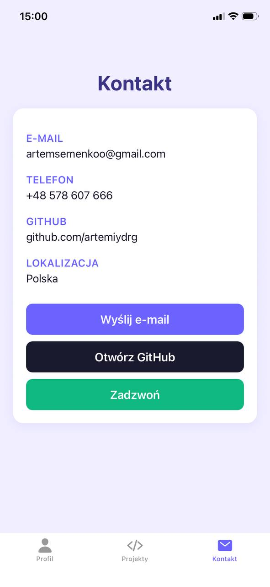

# 📱 Portfolio Studenta — Artem Semenko

> Aplikacja mobilna stworzona w React Native z użyciem Expo SDK 54, TypeScript oraz Expo Router.

---

## 📋 Spis treści

- [Opis projektu](#opis-projektu)
- [Cel aplikacji](#cel-aplikacji)
- [Funkcjonalności](#funkcjonalności)
- [Widoki aplikacji](#widoki-aplikacji)
- [Technologie i biblioteki](#technologie-i-biblioteki)
- [Struktura projektu](#struktura-projektu)
- [Instalacja i uruchomienie](#instalacja-i-uruchomienie)

---

## 📝 Opis projektu

**Portfolio Studenta** to mobilna aplikacja na platformę iOS i Android, stworzona w ramach laboratorium z przedmiotu *Programowanie mobilne na iOS* (rok akademicki 2025/2026). Aplikacja służy jako interaktywne portfolio studenta — prezentuje dane profilowe, zrealizowane projekty oraz dane kontaktowe.

Projekt był tworzony etapami w trakcie kolejnych laboratoriów:
- **Lab 1** — budowa bazowego ekranu profilu
- **Lab 3** — nawigacja między ekranami (Expo Router, Tabs, Stack)
- **Lab 4** — stan aplikacji, formularze, AsyncStorage

---

## 🎯 Cel aplikacji

Celem aplikacji jest stworzenie mobilnego portfolio studenta, które:
- prezentuje dane osobowe, opis i umiejętności studenta,
- wyświetla listę zrealizowanych projektów z możliwością przeglądania szczegółów,
- umożliwia kontakt ze studentem przez e-mail, telefon lub GitHub,
- pozwala użytkownikowi edytować swoje dane oraz dodawać nowe projekty,
- przechowuje wszystkie dane trwale na urządzeniu (AsyncStorage).

---

## ⚙️ Funkcjonalności

### 👤 Ekran Profil
- Wyświetlanie zdjęcia profilowego w formie okrągłego avatara
- Imię i nazwisko, kierunek studiów, numer semestru i legitymacji
- Sekcja „O mnie" z opisem studenta
- Lista umiejętności technicznych
- Przycisk „Edytuj profil" — otwiera formularz edycji
- Przycisk „Dowiedz się więcej" — wyświetla okno dialogowe (Alert)
- Edycja danych z walidacją (imię min. 2 znaki, opis min. 10 znaków, min. 1 umiejętność)
- Dane zapisywane w AsyncStorage — widoczne po ponownym uruchomieniu aplikacji

### 📁 Ekran Projekty
- Lista projektów wyświetlana za pomocą komponentu `FlatList`
- Każda karta zawiera: nazwę, krótki opis, technologie (jako kolorowe tagi) i rok realizacji
- Kliknięcie karty przechodzi do ekranu szczegółów projektu
- Przycisk „+ Dodaj projekt" — otwiera formularz dodawania
- Przycisk usuwania (✕) na każdej karcie z potwierdzeniem przez Alert
- Dane projektów zapisywane w AsyncStorage

### 📄 Ekran Szczegóły projektu
- Pełna nazwa i opis projektu
- Lista technologii użytych w projekcie
- Rok realizacji
- Przycisk „Wróć do listy"
- Przycisk „Usuń projekt" z potwierdzeniem

### ➕ Formularz dodawania projektu
- Pola: nazwa, opis, technologie (oddzielone przecinkami), rok realizacji
- Walidacja wszystkich pól:
  - Nazwa: minimum 3 znaki
  - Opis: minimum 10 znaków
  - Technologie: minimum 1
  - Rok: zakres 2000–2030
- Obsługa klawiatury (KeyboardAvoidingView)
- Komunikat o sukcesie po dodaniu

### 📞 Ekran Kontakt
- Dane kontaktowe: e-mail, telefon, GitHub, lokalizacja
- Przycisk „Wyślij e-mail" — otwiera klienta poczty
- Przycisk „Otwórz GitHub" — otwiera przeglądarkę
- Przycisk „Zadzwoń" — otwiera dialer telefonu

---

## 📱 Widoki aplikacji

### Prototyp Figma

Poniżej przedstawiono prototyp aplikacji wykonany w narzędziu Figma, prezentujący trzy główne ekrany:



---

### Zrzuty ekranu z aplikacji (Expo Go)

**Ekran Profil**



---

**Ekran Profil — widok z przyciskami**



---

**Ekran Projekty**



---

**Ekran Kontakt**



---

### Nawigacja
Aplikacja korzysta z nawigacji dolnej (**Tabs**) z trzema zakładkami:

| Zakładka | Ikona | Opis |
|----------|-------|------|
| Profil | 👤 person | Ekran profilu studenta |
| Projekty | 💻 code-slash | Lista projektów + szczegóły (Stack) |
| Kontakt | ✉️ mail | Dane kontaktowe |

### Schemat nawigacji

```
App (Tabs)
├── Profil (index.tsx)
├── Projekty (projects/)
│   ├── Lista projektów (index.tsx)
│   ├── Szczegóły projektu ([id].tsx)  ← Stack
│   └── Nowy projekt (new.tsx)         ← Stack
└── Kontakt (contact.tsx)
```

### Kolorystyka

| Element | Kolor |
|---------|-------|
| Tło aplikacji | `#f0eeff` (jasny fioletowy) |
| Karta | `#ffffff` (biały) |
| Akcent główny | `#6C63FF` (fioletowy) |
| Akcent drugorzędny | `#a29bfe` (jasny fioletowy) |
| Przycisk dodawania | `#10b981` (zielony) |
| Przycisk usuwania | `#ef4444` (czerwony) |
| Tagi technologii | `#ede9fe` / `#5b21b6` |

---

## 📚 Technologie i biblioteki

### Wersje głównych technologii

| Technologia | Wersja |
|-------------|--------|
| React | 19.1.0 |
| React Native | 0.76.5 |
| Expo SDK | ~54.0.0 |
| TypeScript | ^5.3.3 |
| Node.js | 20.x+ |

### Użyte biblioteki

| Biblioteka | Wersja | Zastosowanie |
|------------|--------|--------------|
| `expo-router` | ~4.0.0 | Nawigacja oparta na plikach (file-based routing) |
| `@expo/vector-icons` | ^14.0.0 | Ikony w nawigacji dolnej (Ionicons) |
| `@react-native-async-storage/async-storage` | ^2.1.0 | Trwałe przechowywanie danych lokalnie |
| `react-native-screens` | ~4.4.0 | Optymalizacja ekranów nawigacji |
| `react-native-safe-area-context` | ^4.14.0 | Bezpieczny obszar ekranu (SafeAreaView) |
| `react-native-gesture-handler` | ~2.20.0 | Obsługa gestów dotykowych |
| `react-native-reanimated` | ~3.10.0 | Animacje |
| `expo-linking` | ~7.0.0 | Otwieranie zewnętrznych URL (mailto, tel, https) |
| `expo-constants` | ~17.0.0 | Stałe konfiguracyjne aplikacji |
| `babel-preset-expo` | ~54.0.10 | Konfiguracja Babel dla Expo |

### Wzorce architektoniczne
- **Context API** — globalny stan aplikacji (ProjectsContext, ProfileContext)
- **AsyncStorage** — trwałe przechowywanie danych między uruchomieniami
- **File-based routing** — nawigacja przez strukturę katalogów (Expo Router)
- **Controlled components** — formularze z walidacją (TextInput + useState)

---

## 🗂️ Struktura projektu

```
portfolio-studenta/
├── app/
│   ├── _layout.tsx          ← Główny layout (Tabs + Providers)
│   ├── index.tsx            ← Ekran Profil
│   ├── contact.tsx          ← Ekran Kontakt
│   └── projects/
│       ├── _layout.tsx      ← Layout Stack dla projektów
│       ├── index.tsx        ← Lista projektów
│       ├── new.tsx          ← Formularz dodawania projektu
│       └── [id].tsx         ← Szczegóły projektu (routing dynamiczny)
├── context/
│   ├── ProjectsContext.tsx  ← Stan i operacje na projektach
│   └── ProfileContext.tsx   ← Stan i operacje na profilu
├── data/
│   └── projects.ts          ← Domyślne dane projektów
├── utils/
│   └── storage.ts           ← Funkcje pomocnicze AsyncStorage
├── assets/
│   ├── screenshots/         ← Zrzuty ekranu aplikacji
│   └── profile.png          ← Zdjęcie profilowe
├── app.json                 ← Konfiguracja Expo
├── babel.config.js          ← Konfiguracja Babel
├── tsconfig.json            ← Konfiguracja TypeScript
└── package.json             ← Zależności projektu
```

---

## 🚀 Instalacja i uruchomienie

### Wymagania
- Node.js 20.x lub nowszy
- Expo Go (zainstalowane na telefonie z iOS lub Android)
- Telefon i komputer w tej samej sieci Wi-Fi

### Kroki

```bash
# 1. Sklonuj repozytorium
git clone https://github.com/artemiydrg/portfolio-studenta.git

# 2. Przejdź do katalogu
cd portfolio-studenta

# 3. Zainstaluj zależności
npm install --legacy-peer-deps

# 4. Uruchom serwer deweloperski
npx expo start

# 5. Zeskanuj QR kod w Expo Go
```

> Jeśli QR kod nie działa przez Wi-Fi, użyj trybu tunelowego:
> ```bash
> npx expo start --tunnel
> ```

---

## 👨‍💻 Autor

**Artem Semenko**
- Kierunek: Informatyka, 3 rok, semestr 6
- Nr legitymacji: 14872
- GitHub: [github.com/artemiydrg](https://github.com/artemiydrg)
- E-mail: artemsemenkoo@gmail.com
